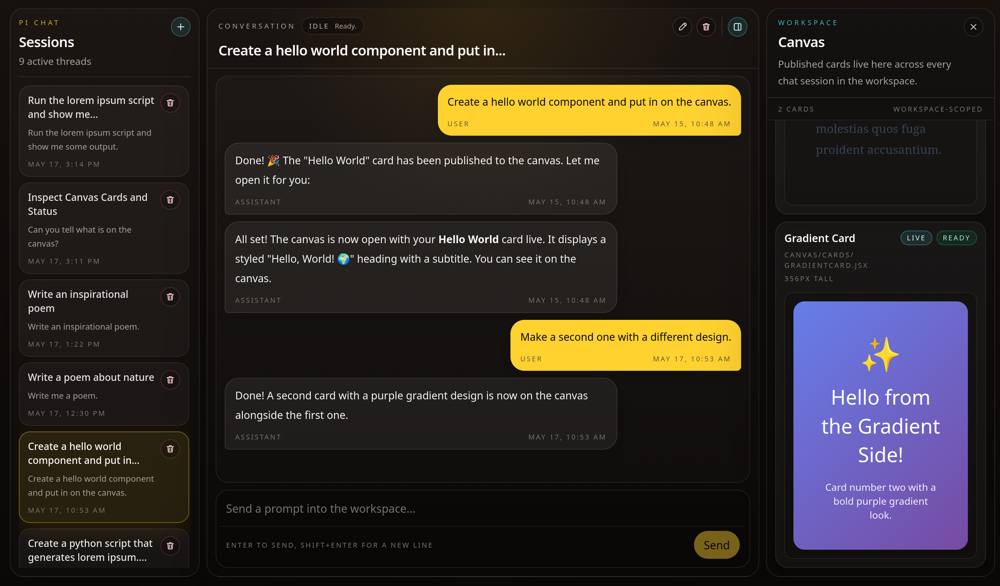

# Pi Chat

## Overview



Pi Chat is a workspace-backed chat application for persistent multi-session conversations with Pi. It lets a user create sessions, revisit prior transcripts, rename sessions, and stream new assistant replies into the UI. Session data and workspace state are stored on disk so the prototype survives normal restarts. The application also constrains agent file and shell access to a dedicated workspace sandbox. In production, the backend serves the built frontend as a single application.

## What It Is

Pi Chat gives a user a chat interface with a list of saved conversations and a live conversation view.

It also includes a workspace-scoped canvas where the backend agent can publish custom React cards that remain visible while the user switches chat sessions.

Users can create a new chat session, return to older sessions, and see the previously stored transcript for each session.

Published canvas cards belong to the workspace rather than any individual conversation, so the same canvas remains available across sessions in the current browser tab.

Session titles automatically fall back to the first user message, and users can later rename any session to a custom title.

When a user sends a message, the assistant response streams into the chat in real time instead of appearing only at the end.

The system keeps the conversation workspace isolated so the assistant can only work inside the allowed project area for that user.

## How It Is Made

### Stack

- Monorepo: npm workspaces
- Backend: Node.js, TypeScript, Fastify, Pi SDK
- Frontend: React, TypeScript, Vite, Tailwind CSS
- Shared contracts: `packages/shared`
- Tests: Vitest and React Testing Library

### Repository Layout

```text
pi-chat/
  packages/
    api/        Fastify backend and embedded Pi runtime
    shared/     Shared DTOs and schemas
    web/        React frontend
  data/         Runtime data, sessions, and workspaces
  templates/    Initial workspace template
  docs/         Planning and research notes
```

### Backend Notes

- The backend owns Pi configuration and does not rely on ambient host Pi state.
- Session and workspace data live under `data/` inside the repository by default.
- The prototype uses the `anonymous` user and provisions one workspace for that user.
- Shell execution is sandboxed with `bubblewrap`, and file tools are restricted to the user workspace.
- Backend-managed custom instructions and skills live under `templates/agent-resources/` and are synchronized into `data/system/agent-resources/` during backend startup.
- In production, the API serves the built frontend from `packages/web/dist`.

### Custom Backend Instructions And Skills

To customize the backend agent without allowing workspace-controlled prompt injection:

- edit `templates/agent-resources/append-system-prompt.md` to add instructions that should be appended to the backend agent's base system prompt
- add skill directories under `templates/agent-resources/skills/`; each skill directory should contain a `SKILL.md` file and any supporting scripts or reference files

These files are synchronized into `data/system/agent-resources/` during backend startup. Restart the backend after changing them.

### Required Environment Variables

Set these before starting the API. When present, the backend also loads `.env` from the repository root automatically, so `npm run dev:api` will pick it up without extra shell setup:

- `PI_PROVIDER`
- `PI_MODEL_ID`

Provider credentials follow the Pi SDK's native environment variables for the selected provider. For example:

- `OPENROUTER_API_KEY` when `PI_PROVIDER=openrouter`
- `OPENAI_API_KEY` when `PI_PROVIDER=openai`
- `ANTHROPIC_API_KEY` when `PI_PROVIDER=anthropic`

You can also provide provider credentials through `data/system/auth.json` instead of environment variables.

Optional configuration:

- `PORT` default: `3000`
- `HOST` default: `0.0.0.0`
- `PI_CHAT_DATA_ROOT` default: `./data`
- `PI_CHAT_TEMPLATE_ROOT` default: `./templates/workspace`
- `PI_CHAT_DEFAULT_USER_ID` default: `anonymous`
- `PI_SANDBOX_REQUIRED` default: `true`
- `NODE_ENV` default: `development`

### Prerequisites

- Node.js `>=20.6.0`
- npm
- `bubblewrap` available on the host when sandboxing is enabled

Install dependencies from the repository root:

```bash
npm install
```

### Start in Development

Run the API and frontend in separate terminals from the repository root.

Start the backend:

```bash
npm run dev:api
```

Start the frontend:

```bash
npm run dev:web
```

The web app uses the Vite dev server and proxies `/api` requests to the backend.

### Run Tests

Run the full workspace test suite:

```bash
npm run test
```

Run backend tests only:

```bash
npm run test --workspace @pi-chat/api
```

Run frontend tests only:

```bash
npm run test --workspace @pi-chat/web
```

### Build

Build all workspaces from the repository root:

```bash
npm run build
```

This builds shared contracts first, then the web app, then the API.

### Start the Built Application

After building, start the backend in production mode from the repository root:

```bash
NODE_ENV=production node packages/api/dist/index.js
```

In production mode, the backend expects a built frontend at `packages/web/dist` and serves it directly.